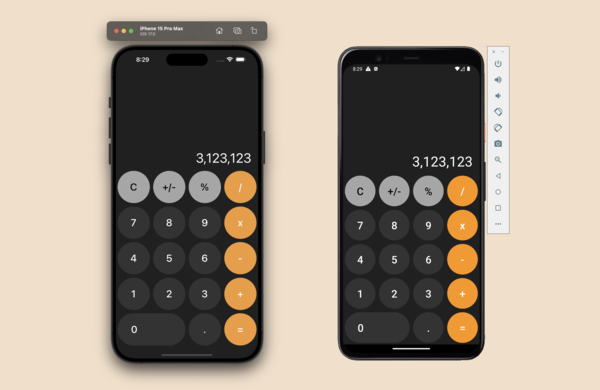

# Clone of iOS Calculator

## Description

You will build a clone of the basic iOS Calculator in this project. The application will look exactly like the basic iOS Calculator, and functions properly.

## Level

Intermediate

## Tags

Mobile, iOS Calculator, CSS

## What you will build

You will build a clone of the basic iOS Calculator in this project. The application will look exactly like the basic iOS Calculator, and functions properly. However, different from the iOS Calculator, this application won't turn into a scentific calculator when the landscape view is used.

By building this project, you will learn how to use CSS to style a relatively complex mobile application, as well as deal with the logic of a calculator in a systematic approach.

## Where to start

To kick off this project, you can start with the following files:

- `design.md`: This file contains the design specification.
- `demo`: This folder contains a few demo images of the application.
- `fonts`: This folder contains all the fonts you need for this project.

## What else you need to know about this project

We recommend overwriting this `README.md` file with your own. To help you get started, we've provided [a template `README-template.md`](./README-template.md).

You have the admin access to this repository. You can push your code to this repository, or transfer this repository to your own GitHub account.

If possible, you should test your design on both iOS and Android devices.